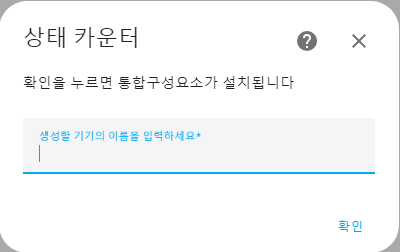
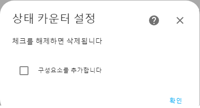
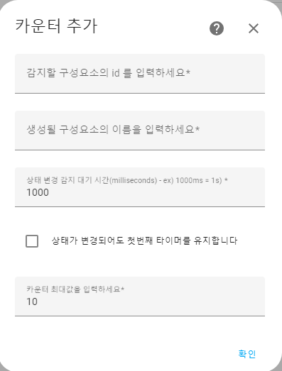
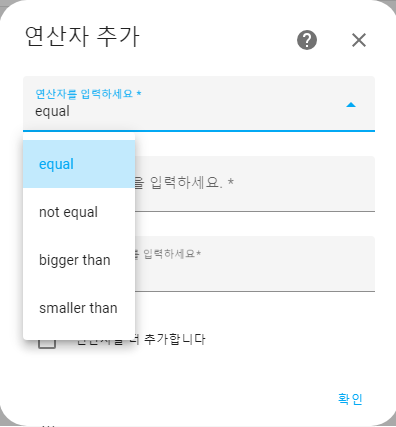
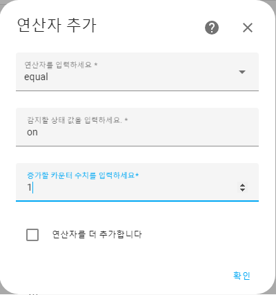
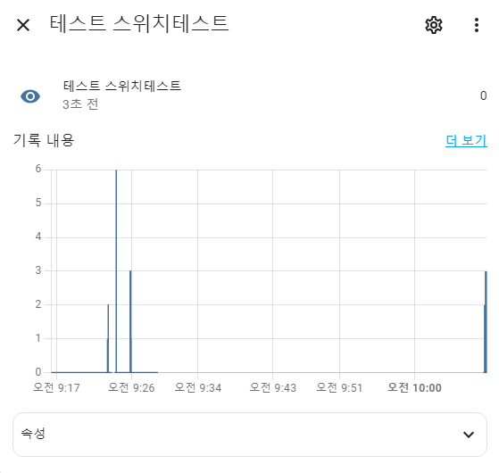

엔티티의 상태값 변경을 감지하여 카운트 할 수 있는 컴포넌트입니다.

---

## - 설치 방법
 

- 소스코드를 다운로드 받은 후 HA 내부의 custom_components 경로에 state_counter 폴더를 넣어주고 재시작

또는

- HACS
HACS 의 custom repository에 https://github.com/oukene/state_counter 주소를 integration 으로 추가 후 설치

설치 후 통합구성요소 추가하기에서 state counter를 검색 하여 설치 한 후 구성을 진행합니다.
  

생성할 기기의 이름을 입력 하고 우선 통합구성요소를 설치를 합니다.

통합구성요소의 구성 입력을 통해 설정을 추가합니다.

감지할 구성요소의 id, 이름, 감지 대기시간, 카운터 최대값을 입력 한 후

※ 감지 대기시간 - 최초 상태 감지가 이루어진 후 카운트를 완료하기까지의 대기시간

예시)
binary sensor 가 on 일때 카운트를 1증가 시키고 이 지연시간이 1초로 설정되어있을 경우, 1초 내에 다시 on 상태로 변경되면 카운터를 증가시키고 다시 또 1초를 대기, 

(카운트를 완료하기까지의 대기 시간입니다)

첫번째 타이머를 유지하는 옵션이 켜질 경우, 상태 조건이 다시 만족하더라도 타이머를 유지합니다.(설정된 시간까지만 기다린 후 종료)

예시)
binary sensor 가 on 일때 카운트를 1증가 시키고 이 지연시간이 1초로 설정되어있을 경우, 1초 내에 다시 on 상태로 변경 되더라도 카운터를 증가 시킨 후 최초의 1초 타이머가 끝나면 카운트를 종료합니다.

상태를 체크 할 방법을 설정합니다.

equal 은 같음

not equal 은 같지 않음

bigger than 은 초과

smaller than 은 미만이며

구성요소의 상태값이 설정한 조건에 만족할 경우 카운터를 증가합니다.

설정이 제대로 완료가 되면 상태값이 변함에 따라 카운터가 작동됨을 확인할 수 있습니다.

  
---
History
 
v1.0.0 - 2023.07.24 - 최초 작성 
---
   

